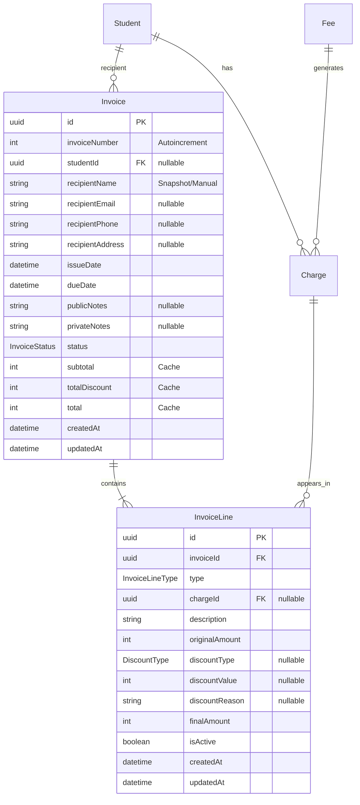

# Módulo de Invoices (Facturas)

## Índice

1. [Descripción General](#descripción-general)
2. [Modelo de Datos](#modelo-de-datos)
3. [Enums](#enums)
4. [Flujos de Estado](#flujos-de-estado)
5. [Reglas de Negocio](#reglas-de-negocio)
6. [API GraphQL](#api-graphql)
7. [Validaciones](#validaciones)
8. [Descuentos](#descuentos)
9. [Recipient Flexibility](#recipient-flexibility)
10. [Concurrencia](#concurrencia)
11. [Consideraciones Futuras](#consideraciones-futuras)

---

## Descripción General

El módulo de **Invoice** permite agrupar uno o varios `Charge` (cuotas/deudas) de un estudiante en un documento de factura para su cobro y registro contable.

### Conceptos Clave

| Concepto      | Descripción                                                                 |
| ------------- | --------------------------------------------------------------------------- |
| **Fee**       | Plantilla/schedule de un cargo recurrente (ej: "Cuota Mensual $10.000")     |
| **Charge**    | Deuda puntual del alumno, generada desde un Fee                             |
| **Invoice**   | Documento que agrupa Charges para facturar                                  |
| **InvoiceLine** | Línea individual dentro de la factura (puede venir de un Charge o ser manual) |

### Relación entre Entidades

```
Fee (plantilla)
  └── genera → Charge (deuda puntual, snapshot de Fee.cost)
                  └── se incluye en → InvoiceLine (snapshot de Charge.amount + descuento)
                                          └── pertenece a → Invoice
```

---

## Modelo de Datos

### Diagrama ER



### Tabla: Invoice

| Campo            | Tipo           | Descripción                                           |
| ---------------- | -------------- | ----------------------------------------------------- |
| `id`             | UUID           | Primary key                                           |
| `invoiceNumber`  | Int            | Número secuencial automático (autoincrement)          |
| `studentId`      | UUID (nullable)| FK a Student. Null si recipient es "OTHER"            |
| `recipientName`  | String         | Nombre del destinatario (siempre requerido)           |
| `recipientEmail` | String?        | Email del destinatario                                |
| `recipientPhone` | String?        | Teléfono del destinatario                             |
| `recipientAddress`| String?       | Dirección del destinatario                            |
| `issueDate`      | DateTime       | Fecha de emisión                                      |
| `dueDate`        | DateTime       | Fecha de vencimiento                                  |
| `publicNotes`    | String?        | Notas visibles en la factura                          |
| `privateNotes`   | String?        | Notas internas (no se muestran al cliente)            |
| `status`         | InvoiceStatus  | Estado de la factura                                  |
| `subtotal`       | Int            | Suma de `originalAmount` de líneas activas (centavos) |
| `totalDiscount`  | Int            | Suma de descuentos de líneas activas (centavos)       |
| `total`          | Int            | Suma de `finalAmount` de líneas activas (centavos)    |

### Tabla: InvoiceLine

| Campo            | Tipo             | Descripción                                         |
| ---------------- | ---------------- | --------------------------------------------------- |
| `id`             | UUID             | Primary key                                         |
| `invoiceId`      | UUID             | FK a Invoice                                        |
| `type`           | InvoiceLineType  | Tipo de línea (CHARGE o MANUAL)                     |
| `chargeId`       | UUID (nullable)  | FK a Charge. Null si type es MANUAL                 |
| `description`    | String           | Descripción (snapshot de Fee.description o manual)  |
| `originalAmount` | Int              | Monto original (snapshot de Charge.amount o manual) |
| `discountType`   | DiscountType?    | Tipo de descuento aplicado                          |
| `discountValue`  | Int?             | Valor del descuento (% o centavos)                  |
| `discountReason` | String?          | Razón/motivo del descuento                          |
| `finalAmount`    | Int              | Monto final después del descuento                   |
| `isActive`       | Boolean          | Flag técnico (true=activa, false=histórica)         |

---

## Enums

### InvoiceStatus

| Valor           | Descripción                                    |
| --------------- | ---------------------------------------------- |
| `ISSUED`        | Factura emitida, pendiente de pago             |
| `PAID`          | Factura completamente pagada                   |
| `PARTIALLY_PAID`| Factura con pago parcial (uso futuro)          |
| `VOID`          | Factura anulada (soft delete)                  |

### InvoiceLineType

| Valor    | Descripción                                              |
| -------- | -------------------------------------------------------- |
| `CHARGE` | Línea que proviene de un Charge existente del estudiante |
| `MANUAL` | Línea ad-hoc creada manualmente (ajuste, materiales, etc)|

### DiscountType

| Valor          | Descripción                                        |
| -------------- | -------------------------------------------------- |
| `PERCENT`      | Descuento porcentual (0-100)                       |
| `FIXED_AMOUNT` | Descuento de monto fijo (en centavos)              |

---

## Flujos de Estado

### Charge.status Flow

```
                    ┌──────────────────────────────────┐
                    │                                  │
                    ▼                                  │
              ┌─────────┐     incluido en          ┌──────────┐
              │ PENDING │ ───────────────────────► │ INVOICED │
              └─────────┘       Invoice            └──────────┘
                    ▲                                  │
                    │                                  │
                    │  - Invoice VOID                  │ pago completo
                    │  - Line removida                 │
                    │                                  ▼
                    │                              ┌───────┐
                    └────────────────────────────  │ PAID  │
                                                   └───────┘
```

| Transición                    | Trigger                                        |
| ----------------------------- | ---------------------------------------------- |
| `PENDING → INVOICED`          | Se incluye en una Invoice (createInvoice)      |
| `INVOICED → PENDING`          | Se remueve de Invoice o Invoice es anulada     |
| `INVOICED → PAID`             | Se registra pago completo (futuro)             |

### Invoice.status Flow

```
              ┌────────┐
              │ ISSUED │ ◄─── Estado inicial
              └────────┘
                   │
          ┌────────┴────────┐
          ▼                 ▼
    ┌───────────────┐   ┌───────┐
    │ PARTIALLY_PAID│   │ VOID  │
    └───────────────┘   └───────┘
          │
          ▼
       ┌──────┐
       │ PAID │
       └──────┘
```

---

## Reglas de Negocio

### Creación de Invoice

1. **Mínimo una línea**: Toda factura debe tener al menos 1 línea
2. **Sin duplicados**: No se permite el mismo `chargeId` dos veces en las líneas
3. **Solo PENDING**: Los charges deben estar en status `PENDING` para ser facturados
4. **Pertenencia**: Si se especifica `studentId`, todos los charges deben pertenecer a ese student
5. **Recipient requerido**: `recipientName` siempre es obligatorio

### Totales (Cache)

Los campos `subtotal`, `totalDiscount` y `total` son **calculados en el backend** cada vez que:
- Se crea una factura
- Se agrega una línea
- Se actualiza una línea (descuento)
- Se remueve una línea

**Fórmulas:**
```typescript
subtotal = Σ(lines.filter(isActive).originalAmount)
totalDiscount = Σ(lines.filter(isActive).discountAmount)
total = Σ(lines.filter(isActive).finalAmount)
```

### Líneas Inactivas (isActive)

El flag `isActive` permite mantener historial:
- **true**: Línea activa, cuenta para totales
- **false**: Línea histórica, NO cuenta para totales

Cuándo se pone `isActive = false`:
- Al remover una línea (`removeInvoiceLine`)
- Al anular la factura (`voidInvoice`)

**Importante**: Nunca se "revive" una línea. Si se vuelve a facturar un Charge, se crea una **nueva** InvoiceLine.

### Partial Unique Index

Para evitar que un Charge esté en múltiples facturas activas simultáneamente:

```sql
CREATE UNIQUE INDEX uniq_active_charge_invoiceline
ON "InvoiceLine" ("chargeId")
WHERE "chargeId" IS NOT NULL AND "isActive" = true;
```

Esto permite:
- ✅ Un Charge en una sola InvoiceLine activa
- ✅ Múltiples InvoiceLines históricas para el mismo Charge
- ❌ Un Charge en dos InvoiceLines activas (error de constraint)

---

## API GraphQL

### Mutations

#### createInvoice

Crea una nueva factura con sus líneas.

```graphql
mutation CreateInvoice($input: CreateInvoiceInput!) {
  createInvoice(input: $input) {
    id
    invoiceNumber
    status
    subtotal
    totalDiscount
    total
    lines {
      id
      description
      originalAmount
      finalAmount
    }
  }
}
```

**Input:**
```typescript
{
  studentId?: string;        // Opcional si recipient es "OTHER"
  recipientName: string;     // Requerido
  recipientEmail?: string;
  recipientPhone?: string;
  recipientAddress?: string;
  issueDate: Date;
  dueDate: Date;
  publicNotes?: string;
  privateNotes?: string;
  lines: CreateInvoiceLineInput[];
}
```

**CreateInvoiceLineInput:**
```typescript
{
  type: "CHARGE" | "MANUAL";
  chargeId?: string;           // Requerido si type = CHARGE
  description?: string;        // Requerido si type = MANUAL
  originalAmount?: number;     // Requerido si type = MANUAL
  discountType?: "PERCENT" | "FIXED_AMOUNT";
  discountValue?: number;      // Para PERCENT (0-100)
  discountValueFixed?: number; // Para FIXED_AMOUNT (centavos)
  discountReason?: string;
}
```

#### addInvoiceLine

Agrega una línea a una factura existente.

```graphql
mutation AddInvoiceLine($input: AddInvoiceLineInput!) {
  addInvoiceLine(input: $input) {
    id
    lines { ... }
    subtotal
    total
  }
}
```

#### updateInvoiceLine

Actualiza el descuento de una línea.

```graphql
mutation UpdateInvoiceLine($input: UpdateInvoiceLineInput!) {
  updateInvoiceLine(input: $input) {
    id
    lines { ... }
    totalDiscount
    total
  }
}
```

**Input:**
```typescript
{
  lineId: string;
  discountType?: "PERCENT" | "FIXED_AMOUNT";
  discountValue?: number;
  discountReason?: string;
}
```

#### removeInvoiceLine

Remueve una línea (soft delete: isActive = false).

```graphql
mutation RemoveInvoiceLine($lineId: String!) {
  removeInvoiceLine(lineId: $lineId) {
    id
    lines { ... }
    subtotal
    total
  }
}
```

**Efectos:**
- La línea pasa a `isActive = false`
- El Charge (si existe) vuelve a `PENDING`
- Los totales se recalculan

#### voidInvoice

Anula una factura (soft delete).

```graphql
mutation VoidInvoice($invoiceId: String!) {
  voidInvoice(invoiceId: $invoiceId) {
    id
    status
  }
}
```

**Efectos:**
- Invoice.status = `VOID`
- Todas las líneas activas pasan a `isActive = false`
- Todos los Charges asociados vuelven a `PENDING`

### Queries

#### invoice

Obtiene una factura por ID.

```graphql
query GetInvoice($id: String!) {
  invoice(id: $id) {
    id
    invoiceNumber
    recipientName
    status
    subtotal
    totalDiscount
    total
    lines {
      id
      type
      description
      originalAmount
      discountType
      discountValue
      finalAmount
    }
  }
}
```

#### invoices

Lista facturas con filtros.

```graphql
query GetInvoices($filter: InvoicesFilterInput) {
  invoices(filter: $filter) {
    id
    invoiceNumber
    recipientName
    status
    total
    issueDate
    dueDate
  }
}
```

**InvoicesFilterInput:**

| Campo          | Tipo           | Descripción                                      |
| -------------- | -------------- | ------------------------------------------------ |
| `studentId`    | ID (opcional)  | Filtra por ID de alumno                          |
| `status`       | InvoiceStatus  | Filtra por estado (ISSUED, PAID, etc.)           |
| `search`       | String         | Busca en `recipientName` (parcial, case-insensitive) |
| `issueDateFrom`| DateTime       | Fecha de emisión >= valor (inclusive)            |
| `issueDateTo`  | DateTime       | Fecha de emisión <= valor (inclusive)            |

**Ejemplo con filtros:**

```graphql
query {
  invoices(filter: {
    search: "García"
    issueDateFrom: "2026-01-01"
    issueDateTo: "2026-01-31"
    status: ISSUED
  }) {
    id
    invoiceNumber
    recipientName
    issueDate
    total
  }
}
```

**Notas:**
- Todos los filtros son opcionales y se combinan con AND
- `search` usa `ILIKE '%valor%'` en PostgreSQL (búsqueda parcial)
- Si no se pasan filtros, retorna todas las facturas ordenadas por fecha de creación desc

---

## Validaciones

### En Creación (createInvoice)

| Código | Validación                                      | Error                                           |
| ------ | ----------------------------------------------- | ----------------------------------------------- |
| T11    | Al menos 1 línea                                | "Invoice must have at least 1 line"             |
| T12    | Sin chargeIds duplicados                        | "Duplicate chargeId in lines"                   |
| T13    | Charges deben estar PENDING                     | "Cargos no encontrados o no disponibles: ..."   |
| T14    | Charges deben pertenecer al student             | "Charge does not belong to student: ..."        |

### En Descuentos

| Código | Validación                                      | Error                                           |
| ------ | ----------------------------------------------- | ----------------------------------------------- |
| T15    | Percent ≤ 100                                   | "Percent discount must be between 0 and 100"    |
| T16    | Percent ≥ 0                                     | "Discount value cannot be negative"             |
| T17    | Fixed ≤ originalAmount                          | "Discount exceeds amount"                       |
| T18    | Fixed ≥ 0                                       | "Discount value cannot be negative"             |

### En Operaciones

| Operación          | Validación                                    | Error                                           |
| ------------------ | --------------------------------------------- | ----------------------------------------------- |
| updateInvoiceLine  | Línea debe estar activa                       | "No se puede editar una línea inactiva"         |
| updateInvoiceLine  | Invoice no debe estar VOID                    | "No se puede editar una factura anulada"        |
| removeInvoiceLine  | Línea debe estar activa                       | "La línea ya está inactiva"                     |
| removeInvoiceLine  | Invoice no debe estar VOID                    | "No se puede modificar una factura anulada"     |
| voidInvoice        | Invoice no debe estar VOID                    | "La factura ya está anulada"                    |
| voidInvoice        | Invoice no debe estar PAID                    | "No se puede anular una factura pagada"         |
| addInvoiceLine     | Invoice no debe estar VOID                    | "No se pueden agregar líneas a una factura anulada" |

---

## Descuentos

### Cálculo de finalAmount

```typescript
function calculateFinalAmount(
  originalAmount: number,
  discountType?: DiscountType,
  discountValue?: number
): number {
  if (!discountType || !discountValue) {
    return originalAmount;
  }
  
  let discountAmount = 0;
  
  if (discountType === "PERCENT") {
    discountAmount = Math.round((originalAmount * discountValue) / 100);
  } else if (discountType === "FIXED_AMOUNT") {
    discountAmount = discountValue;
  }
  
  return Math.max(0, originalAmount - discountAmount);
}
```

### Ejemplos

| Original | Tipo         | Valor | Descuento | Final |
| -------- | ------------ | ----- | --------- | ----- |
| 10000    | PERCENT      | 10    | 1000      | 9000  |
| 10000    | PERCENT      | 50    | 5000      | 5000  |
| 10000    | FIXED_AMOUNT | 1500  | 1500      | 8500  |
| 10000    | FIXED_AMOUNT | 10000 | 10000     | 0     |

### Descuento NO persiste en Charge

**Importante**: Los descuentos viven **solo en InvoiceLine**, no en Charge.

Si se remueve una línea con descuento y luego se re-factura el mismo Charge:
- La línea histórica conserva el descuento (para auditoría)
- La nueva línea NO hereda el descuento
- El Charge.amount nunca cambia

---

## Recipient Flexibility

### Caso 1: Student como Recipient

```typescript
createInvoice({
  studentId: "student-uuid",
  recipientName: "Juan Pérez",        // Autocomplete desde Student
  recipientEmail: "juan@email.com",   // Autocomplete desde Student
  // ...
})
```

- `studentId` apunta al Student
- Los campos `recipient*` son un **snapshot** de los datos del Student
- Esto permite que si el Student cambia de datos, la factura mantiene los datos originales

### Caso 2: Recipient "OTHER"

```typescript
createInvoice({
  // studentId: null (no se especifica)
  recipientName: "Empresa XYZ",
  recipientEmail: "facturacion@xyz.com",
  recipientAddress: "Calle 123",
  // ...
})
```

- `studentId` es null
- El usuario ingresa manualmente los datos del recipient
- Útil para facturar a terceros (empresas, familiares, etc.)

---

## Concurrencia

### Problema

Dos usuarios intentan crear facturas con el mismo Charge simultáneamente.

### Solución

El **partial unique index** en la base de datos garantiza que solo una operación tenga éxito:

```sql
CREATE UNIQUE INDEX uniq_active_charge_invoiceline
ON "InvoiceLine" ("chargeId")
WHERE "chargeId" IS NOT NULL AND "isActive" = true;
```

### Comportamiento

```
Usuario A: createInvoice(chargeId=C1) ──┐
                                         ├── Solo uno tiene éxito
Usuario B: createInvoice(chargeId=C1) ──┘
```

- El primero que llegue a insertar la línea tiene éxito
- El segundo recibe error de constraint violation
- El servicio captura este error y lo convierte en un error de negocio apropiado

---

## Consideraciones Futuras

### Familias

- Agregar `familyId` como alternativa a `studentId` en Invoice
- Permitir agrupar charges de múltiples estudiantes de una familia

### Intereses por Mora

- Crear nuevo tipo de Charge con origen `LATE_FEE`
- Generar automáticamente cuando una factura pasa de su `dueDate`

### Payments

- Modelo separado que referencia a Invoice
- Soporte para pagos parciales (`PARTIALLY_PAID`)
- Historial de pagos por factura

### Email Notifications

- Opción "Create and Notify" al crear factura
- Template de email con datos de la factura
- Recordatorios automáticos de vencimiento

---

## Estructura de Archivos

```
src/invoices/
├── dto/
│   ├── add-invoice-line.input.ts
│   ├── create-invoice-line.input.ts
│   ├── create-invoice.input.ts
│   └── update-invoice-line.input.ts
├── entities/
│   ├── invoice-line.entity.ts
│   └── invoice.entity.ts
├── enums/
│   ├── discount-type.enum.ts
│   ├── invoice-line-type.enum.ts
│   └── invoice-status.enum.ts
├── utils/
│   └── invoice-calculator.ts
├── invoices.module.ts
├── invoices.resolver.ts
├── invoices.service.ts
└── invoices.service.integration.spec.ts
```

---

## Tests de Integración

El módulo cuenta con una suite completa de tests de integración que cubren:

- **A) Happy paths**: Creación básica de facturas (T1-T5)
- **B) Manual lines**: Líneas manuales (T6)
- **C) Remove/Re-invoice**: Remoción y re-facturación (T7-T8)
- **D) VOID/Delete**: Anulación de facturas (T9-T10)
- **E) Validaciones**: Errores de negocio (T11-T14)
- **F) Descuentos**: Validaciones de descuento (T15-T19)
- **G) Update + recálculo**: Actualización y totales (T20-T21)
- **H) Concurrencia**: Operaciones simultáneas (T22)
- **T25) Descuento → Remove → Re-invoice**: Flujo completo

Ver archivo: `docs/test-cases/INVOICES.md`

Ejecutar tests:
```bash
npm test -- --testPathPattern="invoices.service.integration"
```
